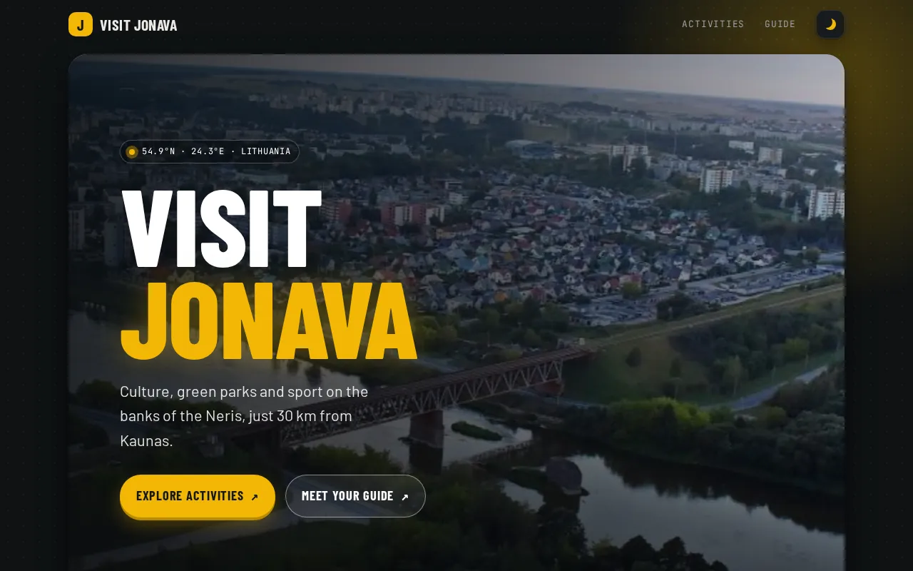

# Visit Jonava

Vieno puslapio kelionių gidas po Jonavą. Tai Scrimba kurso projektas „Hometown homepage“.

**[Gyva demo versija](https://brutall100.github.io/scrimba-hometown-jonava/)** · **[Kodas](https://github.com/brutall100/scrimba-hometown-jonava)**



## Apie projektą

Jonava yra nedidelis miestas prie Neries, maždaug 30 km nuo Kauno. Šis puslapis parodo lankytojams tris geriausias veiklas Jonavoje ir pristato vietinį gidą. Pradžioje tai buvo paprasta Scrimba Frontend Developer kurso užduotis. Vėliau ją perdariau į modernų, prisitaikantį puslapį su šviesiu ir tamsiu režimais.

## Funkcijos

- Didelis viršutinis blokas su animuota antrašte, pulsuojančia vietos žyme ir aiškiais mygtukais
- Juosta „Jonava skaičiais“: skaičiai patys suskaičiuoja, kai puslapis užsikrauna
- Trys veiklų kortelės, kurios pakyla ir priartina nuotrauką užvedus pelę
- Gido skiltis su demo profiliu (Alex Doe) ir mygtuku „Book a walk“, kuris parodo trumpą pranešimą
- Mygtukai pakyla užvedus pelę, nusileidžia paspaudus ir paleidžia bangelę (ripple)
- Taškelių tinklelio fonas su lėtai pulsuojančiu švytėjimu; aplink pelę taškeliai ryškesni
- Šviesus ir tamsus režimai pagal sistemos nustatymą, plius mygtukas, kuris įsimena tavo pasirinkimą
- Veikia telefone (patikrinta 390px pločiu), nėra slinkimo į šoną
- Prieinamumas: „Skip to content“ nuoroda, matomas klaviatūros fokusas (`:focus-visible`), alt tekstai ir `prefers-reduced-motion` palaikymas
- Lengvos WebP nuotraukos, kad puslapis greitai užsikrautų

## Technologijos

- HTML5 (semantinės sekcijos, orientyrai)
- CSS3: kintamieji (custom properties), Grid, Flexbox, `clamp()`, `color-mix()`, animacijos
- JavaScript be bibliotekų: `IntersectionObserver`, `requestAnimationFrame`, `matchMedia`
- Google Fonts: Barlow Condensed, Barlow ir JetBrains Mono

## Ką išmokau

- Kaip planuoti puslapį su dizaino kintamaisiais, kad tamsiam režimui reikėtų pakeisti tik kelias spalvas
- Kaip gerbti vartotojo nustatymus, pvz., `prefers-color-scheme` ir `prefers-reduced-motion`
- Kaip animuoti tik su `transform` ir `opacity`, kad animacijos būtų sklandžios ir neapkrautų procesoriaus
- Kaip riboti pelės įvykius su `requestAnimationFrame`
- Kaip sumažinti nuotraukas ir naudoti WebP formatą
- Kaip padaryti išdėstymą, kuris veikia ir 390px telefone, ir plačiame ekrane

## Paleisk savo kompiuteryje

Nieko kompiliuoti nereikia.

```bash
git clone https://github.com/brutall100/scrimba-hometown-jonava.git
cd scrimba-hometown-jonava
python3 -m http.server 8000
```

Tada atsidaryk <http://localhost:8000>. Arba tiesiog atidaryk `index.html` naršyklėje.

## Projekto struktūra

```
.
├── index.html        # puslapio HTML
├── style.css         # spalvos, išdėstymas, režimai ir animacijos
├── script.js         # režimo mygtukas, bangelė, atsiradimas slenkant, skaičiavimas
├── images/           # Jonavos nuotraukos (WebP)
│   ├── jonava-hero.webp
│   ├── culture-center.webp
│   ├── jonava-valley.webp
│   └── bike-park.webp
└── docs/
    └── screenshot.webp
```

## Padėkos

- Projekto idėja: [Scrimba](https://scrimba.com/) Frontend Developer kursas
- Jonavos nuotraukos naudojamos tik mokymosi tikslais; visos teisės priklauso jų autoriams
- Gidas „Alex Doe“ yra išgalvotas demo profilis
